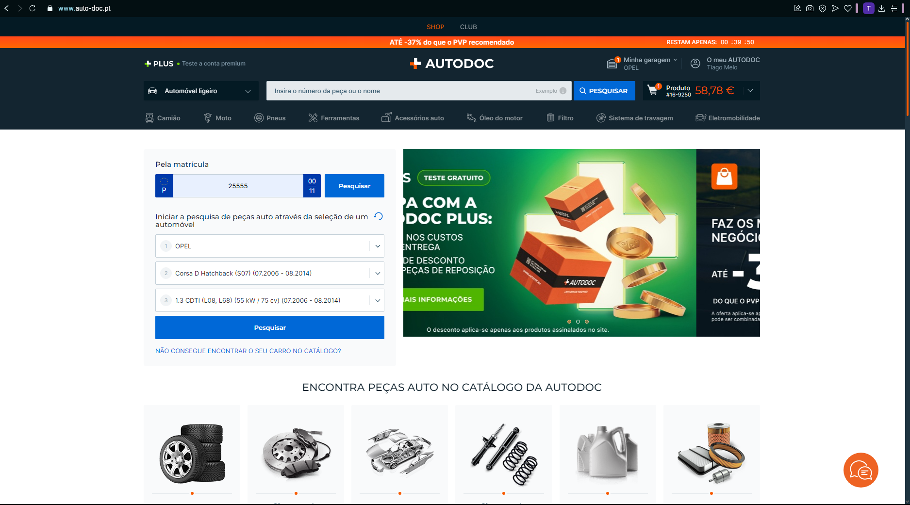
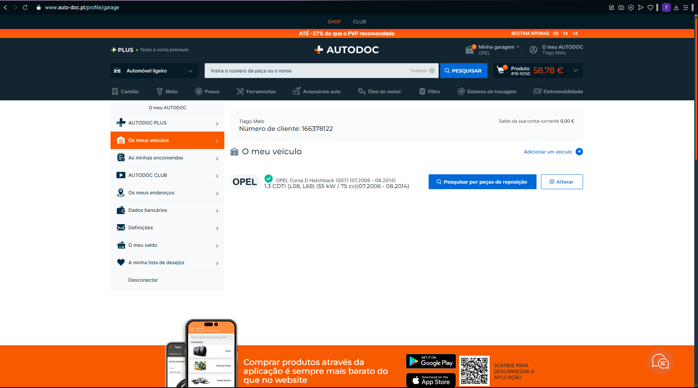
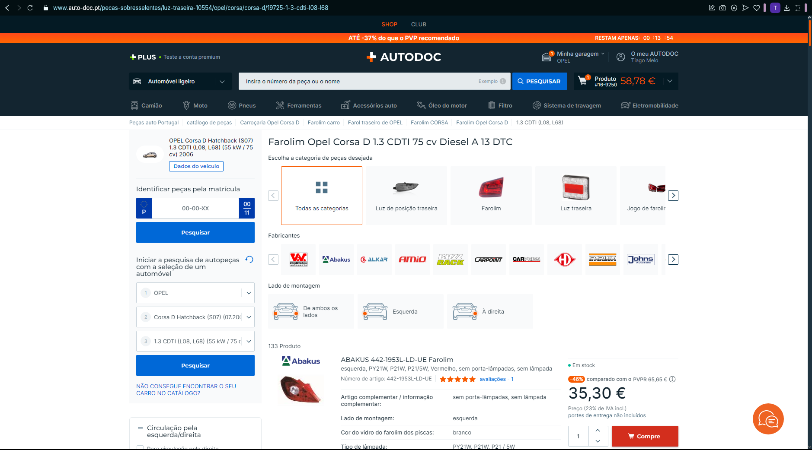

[Back to stage 1](../b_stage_1_context_definition)

# Competitor Analysis: AutoDoc 
## General Information 
- **Name of System:** AutoDoc 
- **Company/Developer:** AutoDoc 
- **Website/Product Page:** [https://www.auto-doc.pt] 
- **Platform(s) Supported:**  Web, Mobile (iOS/Android), Desktop 
- **Target Audience:** Pessoas que querem comprar peças automóveis 

--- 
## Core Functionality 

**Primary Purpose:** O site AutoDoc é uma loja online que permite aos usuários procurar e comprar peças de automóveis de várias marcas e modelos, facilitando a manutenção e reparação dos veículos 

**Key Features:** - [Garagem onde é possível guardar o veículo pessoal] - [Catálogo vasto de peças]

**Unique Selling Points (USPs):** - O que faz este sistema se sobrair é a sua funcionalidade da Garagem que facilita muito a procura de peças para o veículo pessoal do utilizador. Para além disso possui um catálogo enorme de peças automóveis não só para veículos de passageiros como também para camiões e motas. Por fim possui também um live chat que pode facilitar o esclarecimento de dúvidas e também tem vídeos de tutoriais 

**Limitations/Weaknesses:** - Visto que é um sistema grande o apoio ao cliente torna-se mais complexo e isso gera atrasos no suporte ao cliente. Também gera atrasos nas entregas se o sistema não tiver preparado para isso. 

---

## Screenshots

## Online Reviews
- **Trustpilot:** [https://pt.trustpilot.com/review/autodoc.pt]
- **PortaldaQueixa:** [https://portaldaqueixa.com/brands/autodoc/complaints]

[Back to stage 1](../b_stage_1_context_definition)
