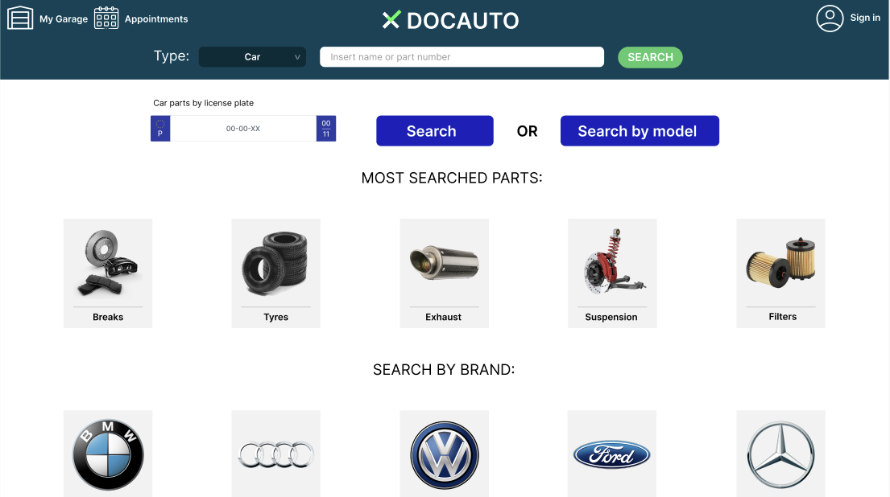

[Back to main Logbook Page](../hci_logbook.md)

---
# Low Fidelity Prototype and Evaluation

## D.1. Low Fidelity Prototype

O nosso grupo decidiu optar por usar o Figma para desenvolver o protótipo de baixa fidelidade, pois considerámos que seria mais fácil implementá-lo posteriormente no website, além de já termos uma ideia visual de como seria o site. Para as pessoas testadas, também era mais prático do que utilizar folhas de papel, o que também incentivou mais pessoas a participar na testagem do nosso protótipo.

Página Inicial:

Low-Fidelity: 
https://www.figma.com/design/5lFRbB63oSPxhb7zvt7uKV/Projeto-IHC-Low-Fidelity?node-id=0-1&p=f&t=yOSHDvAEzWMFIp1c-0

## D.2. Prototype Evaluation

Criamos as seguintes tarefas para testar o nosso protótipo:

1. **Quero criar conta e adicionar informações pessoais (p.e. carro à garagem, personalizar a conta)**
2. **Quero comprar filtro para carro**
3. **Quero criar Appointment para trocar óleo, com informação sobre preço, e disponibilidade**
4. **Quero ver todas as peças compatíveis com o meu carro**
5. **Quero contactar o suporte para esclarecer a entrega**

Entrevistamos 4 alunos da mesma turma e o professor, e obtivemos os seguintes resultados às tarefas:

| Entrevista | Task 1         | Task 2                                                                 | Task 3                                                                 | Task 4                                                                 | Task 5                                                                 | Extra                                                                 |
|------------|--------------|-----------------------------------------------------------------------|-----------------------------------------------------------------------|-----------------------------------------------------------------------|-----------------------------------------------------------------------|----------------------------------------------------------------------|
| 1          | ok           | Prefere ver compatibilidade antes de comprar peça                     | O campo descrição do appointment devia indicar melhor para que serve    | Chegou lá, mas podia estar mais claro para que serve a search         | Sugeriu pop-up com ponto de interrogação                             | -                                                                    |
| 2          | ok       | ok                                                                | Explicar melhor a descrição no menu appointment                           | ok                                                                | Sugeriu footer a indicar melhor onde está o menu ajuda                | -                                                                    |
| 3          | ok           | Teve tendência a ir para a search bar                                         | Mesma questão na barra descrição                                      | ok                                                       | ok                                                       | Seta para voltar à página inicial no menu                           |
| 4          | ok           | ok                                                                    | Mesma questão na descrição                                            | ok                                                                    | Hesitação mas chegou lá                                               | Dropdown com opções pré-definidas para o appointment                 |
| 5          | ok           | ok                                                                    | Mesma questão na description, sugerido dropdown ou destacar caixa     | ok, mas menu na página inicial ainda confuso                          | ok                                                                   | Sugestão de markdown, bloco de texto e mudar formato de data        |

Com base nestas entrevistas tirámos alguns apontamentos sobre funcionalidades que faltavam implementar e algumas sugestões dos entrevistados:

- Alterar "My Garage" para "My Cars", por ser mais intuitivo

- Adicionar "Carrinho" e opção de "Comprar logo" diretamente na página do produto

- Incluir uma barra de progresso para indicar o estado da compra

- Adicionar botão final “Confirmar” no processo de compra

- Possibilidade de encurtar os passos do processo de compra

- Melhorar o campo de descrição no menu "Appointment" (ex.: usar dropdowns ou destacar a caixa)

- Indicar no "Appointment" que o pedido está “a confirmar pela oficina”

- Adicionar histórico de compras

- Incluir seta ou botão para voltar à página inicial

- Criar botão que leve ao menu incorporado na página inicial

- Melhorar a visibilidade do menu de ajuda (ex.: incluir no footer ou usar ícone de ponto de interrogação)

- Permitir ver compatibilidade da peça com o carro antes da compra

- Adicionar opções de formatação no campo de descrição (ex.: markdown ou bloco de texto)

- Melhorar formato do campo de data

---
[Back to main Logbook Page](../hci_logbook.md)

---