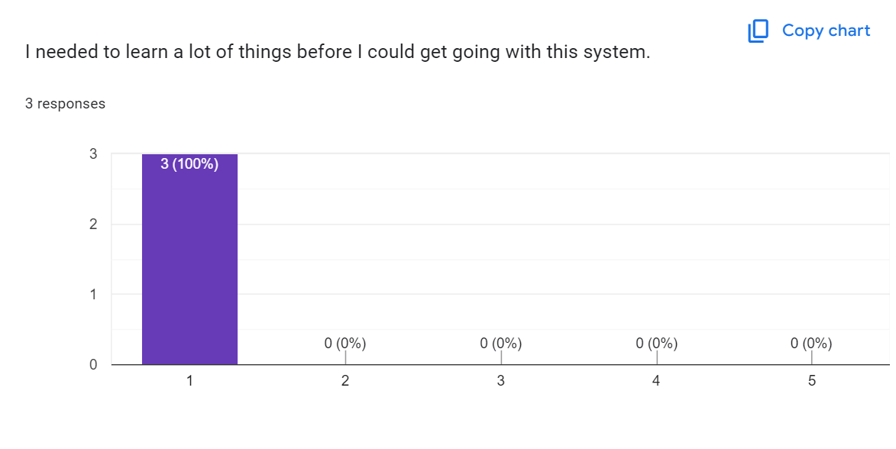

[Back to main Logbook Page](../hci_logbook.md)

---

# E. Functional Prototype and Evaluation

# Prototype

## Ferramentas e Tecnologias Utilizadas

Para desenvolver o protótipo funcional do nosso website, utilizámos uma combinação de **HTML**, **CSS**, **JavaScript** e o **Armazenamento Local** do navegador. O objetivo foi focar na interação do utilizador e no design da interface, em vez de funcionalidades complexas de backend.

- **HTML (Linguagem de Marcação de Hipertexto)**  
  Utilizado para estruturar o conteúdo do website. Forneceu os elementos fundamentais de cada página, incluindo cabeçalhos, parágrafos, botões e campos de input.

- **CSS (Folhas de Estilo em Cascata)**  
  Utilizado para estilizar os elementos visuais do website. Incluiu o formato do layout, esquemas de cores, fontes e técnicas de design responsivo para garantir que a interface fosse visualmente apelativa e fácil de utilizar.

- **JavaScript**  
  Implementado para adicionar interatividade e comportamento dinâmico ao website. Foi utilizado para processar inputs do utilizador, validar formulários, gerir feedback da interface (por exemplo, mostrar/ocultar elementos) e interagir com o armazenamento local.

- **Armazenamento Local (Web Storage API)**  
  Utilizado como uma forma leve e persistente de armazenar dados do utilizador no navegador. Isto permitiu simular uma base de dados sem necessidade de armazenamento no lado do servidor.  
  Os seguintes dados foram armazenados e recuperados utilizando `localStorage`:
  - Itens do carrinho
  - Morada, NIF e número de telefone do utilizador
  - Consultas guardadas
  - Itens da lista de desejos
  - Dados de veículos (garagem)

  Estruturas de dados complexas como arrays ou objetos foram convertidas em strings com `JSON.stringify()` antes de serem armazenadas, e transformadas de volta com `JSON.parse()` quando recuperadas. Esta abordagem foi eficaz para manter o estado da aplicação entre sessões num protótipo puramente frontend.

- **GitHub**  
  Serviu como plataforma de controlo de versões e colaboração. Facilitou a coordenação entre os membros da equipa, permitindo trabalhar em diferentes componentes simultaneamente, acompanhar alterações e resolver conflitos de forma eficiente.

Esta combinação de tecnologias permitiu-nos construir um protótipo funcional e interativo que está alinhado com os princípios da **Interação Humano-Computador (IHC)**, com ênfase na usabilidade, responsividade e design centrado no utilizador.

# Avaliação de Utilizadores
## Teste de Usabilidade

Para recolher informações sobre a experiência dos utilizadores com o nosso protótipo, realizámos três sessões de teste de usabilidade. Os formulários utilizados para recolher os dados foram baseados em templates disponibilizados. Estes testes permitiram-nos identificar pontos fortes e áreas que necessitam de melhorias, focando-nos na facilidade de navegação, clareza das funcionalidades e rapidez na execução das tarefas.

Durante os testes, observámos como os utilizadores interagiram com a interface, quais as dificuldades encontradas e recolhemos o seu feedback direto. Este processo é fundamental para garantir que o produto final seja intuitivo, eficiente e responda às necessidades reais dos utilizadores.

## Questionário de Tarefas
### User Number: 113470

| Task No. | Task Description                                                                 | Difficulty (1–5) |
|----------|-----------------------------------------------------------------------------------|------------------|
| Task 1   | Search for brake pads compatible with a 2020 Renault Clio                        |       5           |
| Task 2   | Search for parts using your vehicle's plate                                      |       5           |
| Task 3   | Schedule a vehicle inspection for next Tuesday                                   |        4          |
| Task 4   | Filter the product list to display only items from one brand                     |       5           |
| Task 5   | Find total cost (including shipping) to deliver brake pads to your home          |         5         |
| Task 6   | Search for parts by your vehicle model and add it to your wishlist               |        5          |
| Task 7   | Add your vehicle to your garage                                                  |         5         |

### User Number: 113435

| Task No. | Task Description                                                                 | Difficulty (1–5) |
|----------|-----------------------------------------------------------------------------------|------------------|
| Task 1   | Search for brake pads compatible with a 2020 Renault Clio                        |       4           |
| Task 2   | Search for parts using your vehicle's plate                                      |       5           |
| Task 3   | Schedule a vehicle inspection for next Tuesday                                   |        5          |
| Task 4   | Filter the product list to display only items from one brand                     |       5           |
| Task 5   | Find total cost (including shipping) to deliver brake pads to your home          |         4         |
| Task 6   | Search for parts by your vehicle model and add it to your wishlist               |        5          |
| Task 7   | Add your vehicle to your garage                                                  |         4         |

### User Number: 113553

| Task No. | Task Description                                                                 | Difficulty (1–5) |
|----------|-----------------------------------------------------------------------------------|------------------|
| Task 1   | Search for brake pads compatible with a 2020 Renault Clio                        |       5           |
| Task 2   | Search for parts using your vehicle's plate                                      |       5           |
| Task 3   | Schedule a vehicle inspection for next Tuesday                                   |        5          |
| Task 4   | Filter the product list to display only items from one brand                     |       5           |
| Task 5   | Find total cost (including shipping) to deliver brake pads to your home          |         4         |
| Task 6   | Search for parts by your vehicle model and add it to your wishlist               |        5          |
| Task 7   | Add your vehicle to your garage                                                  |         5         |

**Note:**  
**1** = Very Difficult  **5** = Very Easy

### Formulário utilizado:

### Template:

## Questionário pós-tarefas
Após a realização das tarefas, foi aplicado um questionário com o objetivo de recolher feedback direto dos participantes. Para isso, foi utilizado o método SUS (System Usability Scale), uma ferramenta amplamente reconhecida para avaliar a usabilidade de sistemas. Através deste questionário, foi possível medir a experiência do utilizador, identificar dificuldades sentidas e obter uma perceção geral sobre a eficácia e facilidade de uso da solução apresentada.. Para este questionário optámos por fazer um [Google Forms](https://docs.google.com/forms/d/e/1FAIpQLScJ8UsA7JDWbN5ZznRe4A9k_Ihsxd7u9tBJbSSftdFvYnWNvw/viewform?usp=dialog) para ser mais fácil poder juntar e analizar os dados.

### Template:

## Tabela de Observação
Para melhor monitorizar e recolher informação adicional, foi utilizada uma tabela de observação que permitiu registar, de forma sistemática, comportamentos, reações e acontecimentos relevantes ao longo do processo. Esta ferramenta facilitou a organização dos dados recolhidos e contribuiu para uma análise mais rigorosa e estruturada das situações observadas.

### Template

## Conclusões
Com base nas respostas dos três utilizadores, pode-se concluir que a maioria das tarefas foi classificada como fácil ou muito fácil, indicando uma boa usabilidade da interface nas funcionalidades testadas. Embora dois dos três utilizadores fossem inexperientes neste tipo de aplicações, o que resultou em algumas discrepâncias, principalmente nos resultados do questionário pós-tarefas, os dados obtidos foram bastante úteis para o aprimoramento do website.

Em suma, os resultados demonstram que o sistema é bem aceite pelos utilizadores, destacando-se apenas um ponto de melhoria: quando o utilizador não possui os dados necessários associados à sua conta, o processo de checkout torna-se um pouco tedioso, exigindo navegação repetida entre a página de finalização de compra e a área do utilizador. Essa observação sugere a necessidade de otimizar esse fluxo para maior eficiência e satisfação do utilizador.

---
[Back to main Logbook Page](../hci_logbook.md)

---