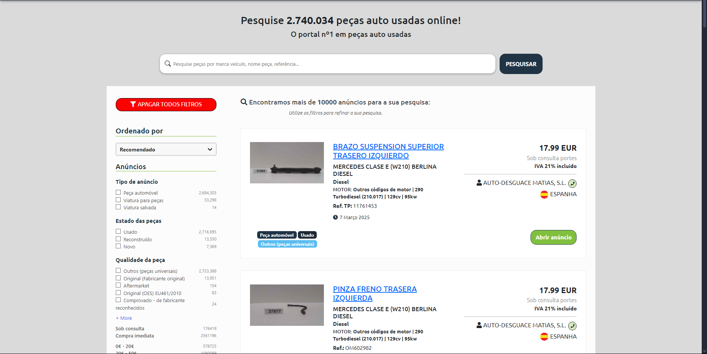
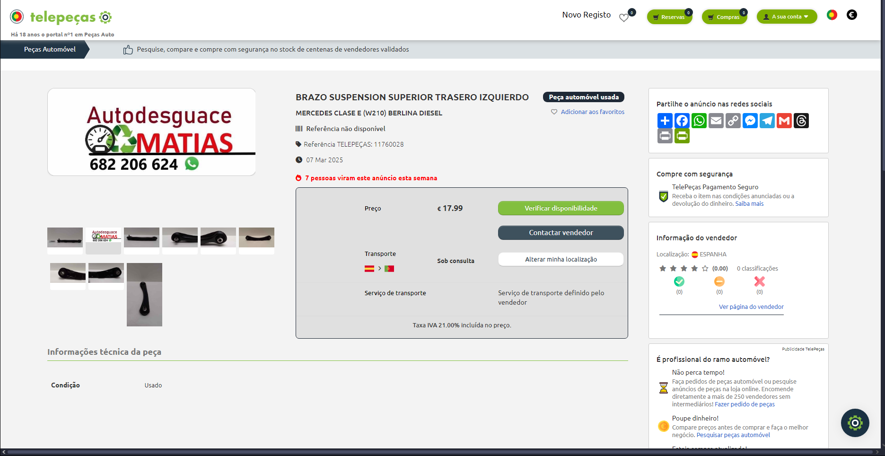

[Back to stage 1](../b_stage_1_context_definition)

# Competitor Analysis: Telepeças 
## General Information 
- **Name of System:** Telepeças 
- **Company/Developer:** Telepeças 
- **Website/Product Page:** [https://pt.telepecas.com] 
- **Platform(s) Supported:** Web, Mobile (iOS/Android), Desktop 
- **Target Audience:** O foco principal são pessoas e empresas que procuram peças automóveis usadas de forma prática, rápida e segura através de uma plataforma digital.

--- 
## Core Functionality 

**Primary Purpose:** O objetivo principal da TelePeças é facilitar a compra e venda de peças automóveis usadas, juntando compradores e vendedores através de uma plataforma online eficiente. Através da sua interface, a empresa visa proporcionar acesso rápido e seguro a peças de reposição a preços acessíveis, especialmente para mecânicos e entusiastas de automóveis que preferem realizar manutenção e reparos de forma económica. Além disso, a TelePeças também visa digitalizar o setor de peças automóveis usadas, promovendo a sustentabilidade e o uso responsável de recursos ao fomentar a reutilização de peças.

**Key Features:** - [Suporte a ambos mecânicos e entusiastas de automóveis] - [Catálogo diversificado de peças] - [Compra e venda de peças usadas] 

**Unique Selling Points (USPs):** - A TelePeças destaca-se pela sua capacidade de oferecer uma plataforma online especializada na compra e venda de peças automóveis usadas, proporcionando uma solução conveniente e segura tanto para profissionais quanto para entusiastas de automóveis. O grande diferencial da plataforma é a sua rede de fornecedores validados, o que garante que os produtos oferecidos sejam de qualidade e confiáveis. Além disso, a pesquisa avançada permite que os usuários encontrem peças específicas de maneira rápida e eficiente, enquanto o sistema de múltiplas respostas a cada pedido de peça facilita a comparação de preços e condições, aumentando as chances de encontrar a opção ideal.

**Limitations/Weaknesses:** - A Telepeças enfrenta alguns desafios, como a dependência de fornecedores externos, o que pode resultar em uma oferta limitada de peças específicas em alguns casos. Como a plataforma é focada em peças usadas, a disponibilidade e a condição das peças podem variar, o que pode gerar incertezas para os clientes em relação à qualidade e durabilidade. A falta de serviços de instalação integrados na plataforma também pode ser um obstáculo para muitos compradores.

---

## Screenshots

## Online Reviews
- **Trustpilot:** [https://pt.trustpilot.com/review/telepecas.com]
- **PortaldaQueixaxa:** [https://portaldaqueixa.com/brands/telepecas/complaints]

[Back to stage 1](../b_stage_1_context_definition)
