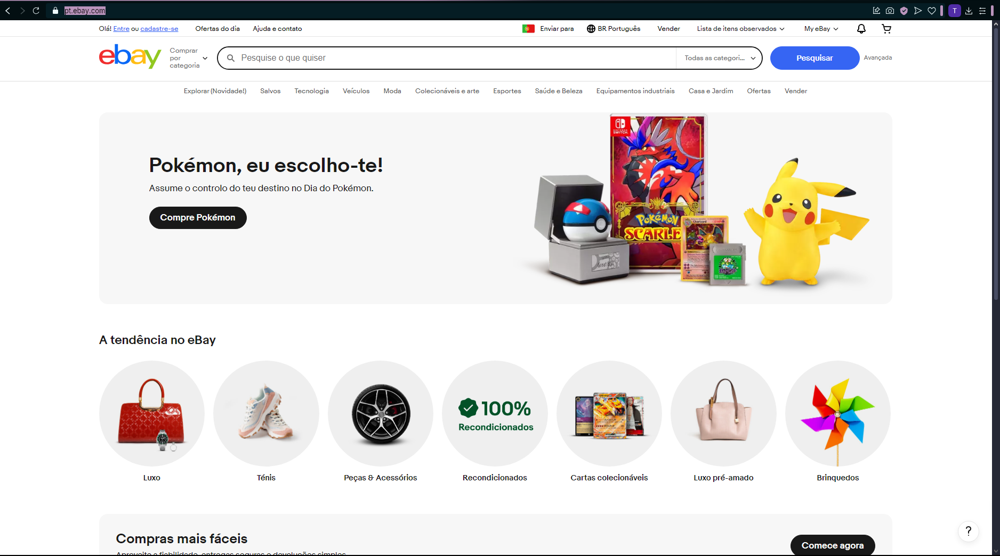
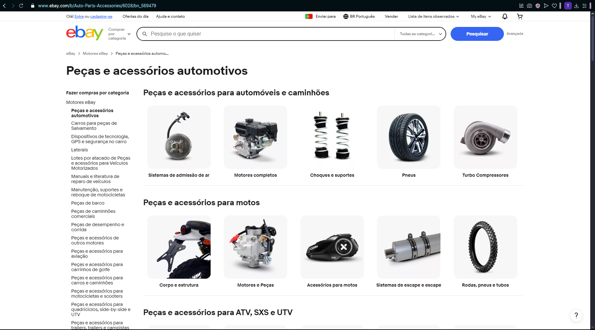
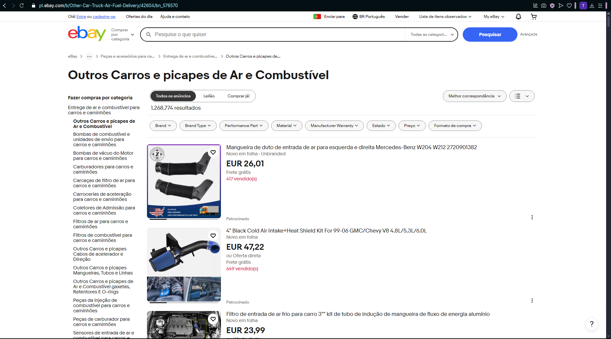

[Back to stage 1](../b_stage_1_context_definition)

# Competitor Analysis: eBay 
## General Information 
- **Name of System:** eBay 
- **Company/Developer:** eBay Inc. 
- **Website/Product Page:** [https://pt.ebay.com] 
- **Platform(s) Supported:** Web, Mobile (iOS/Android), Desktop 
- **Target Audience:** Este sistema destina-se a pessoas em busca de produtos novos e usados a preços competitivos, colecionáveis ou items vintage e leilões online. Destina-se também a pequenos e médio vendedores 

--- 
## Core Functionality 

**Primary Purpose:** O eBay é um marketplace online concebido para ligar compradores e vendedores de todo o mundo. A plataforma permite a compra e venda de uma grande variedade de produtos, novos e usados, através de vendas diretas ou leilões. O sistema disponibiliza ferramentas para que os vendedores possam gerir os seus anúncios, pagamentos e envios, enquanto os compradores podem pesquisar, comparar preços e licitar produtos. Além disso, o eBay assegura a segurança das transações através de políticas de proteção tanto para compradores como para vendedores.

**Key Features:** - [Leilão] - [Envio global] - [Compra e venda de produtos] 

**Unique Selling Points (USPs):** - O eBay distingue-se como um marketplace global que combina leilões online e compras diretas, permitindo aos utilizadores encontrar produtos novos, usados e raros a preços competitivos. A plataforma oferece proteção ao comprador através da eBay Money Back Guarantee, garantindo transações seguras. Além disso, destaca-se pela sua variedade de produtos, desde itens do dia a dia até colecionáveis exclusivos. Para os vendedores, o eBay proporciona ferramentas avançadas de gestão, alcance global e uma forma acessível de expandir negócios sem necessidade de um site próprio. 

**Limitations/Weaknesses:** - O eBay enfrenta alguns desafios, como alta concorrência para vendedores, taxas sobre vendas, e tempos de entrega longos em envios internacionais. Além disso, há riscos de fraudes e disputas, e o suporte ao cliente pode ser inconsistente. 

---

## Screenshots

## Online Reviews
- **Trustpilot:** [https://pt.trustpilot.com/review/ebay.com]
- **PortaldaQueixaxa:** [https://portaldaqueixa.com/brands/ebay/complaints]

[Back to stage 1](../b_stage_1_context_definition)
